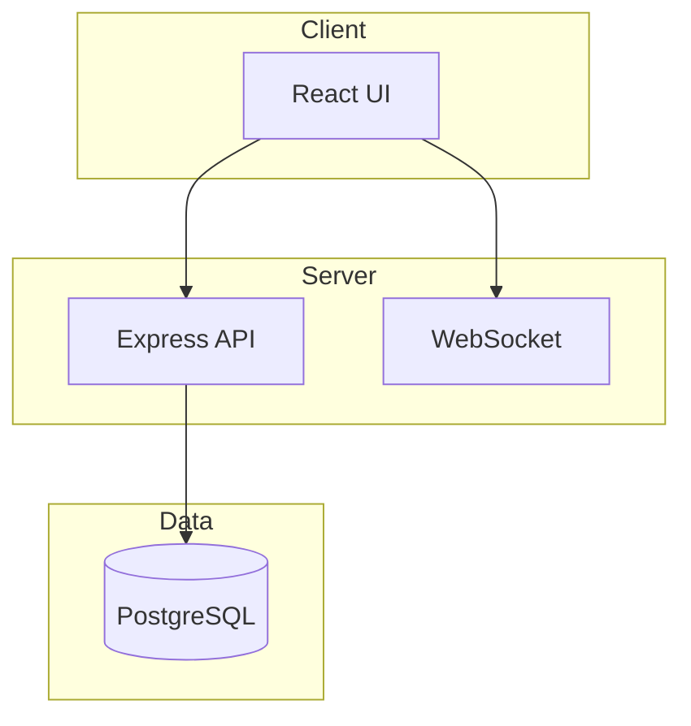
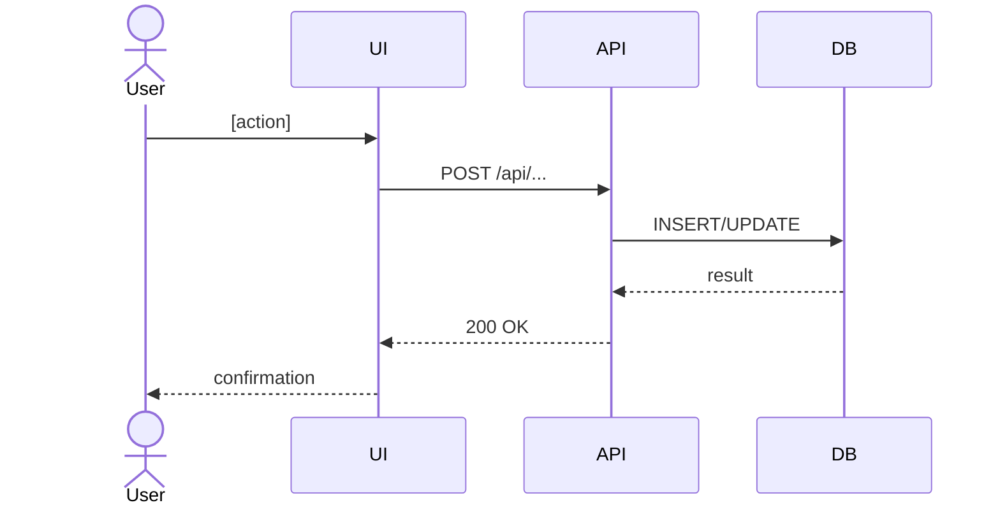

# Project Planning

Read this skill when generating a project plan after requirements are confirmed. Requirements intake and ambiguity detection are handled by the `requirements-analyst` skill — load that first if a project story or issue needs clarification.

---

## 1. Plan Document Structure

Generate these documents for every new project (store as project documents with `kind: "plan"`):

### 1a. Technical Requirements
```markdown
# Technical Requirements — [Project Name]

## Functional Requirements
- FR-001: [requirement]
- ...

## Non-Functional Requirements
- NFR-001: [performance / security / scalability requirement]
- ...

## Assumptions
- [Any assumption made due to incomplete story]
```

### 1b. Tech Stack Decision
```markdown
# Tech Stack — [Project Name]

## Confirmed Stack (from company/project settings)
- Languages: [...]
- Frameworks: [...]
- Databases: [...]
- Infrastructure: [...]

## Divergences / Additions Proposed
- [If none: "No divergences from defined stack"]
- [If any: describe and link to approval request]
```

### 1c. Infrastructure Plan
```markdown
# Infrastructure Plan — [Project Name]

## Environments
| Environment | Host | Port | Deploy method |
|-------------|------|------|---------------|
| staging | [...] | [...] | [...] |
| production | [...] | [...] | [...] |

## Environment Variables Required
| Variable | Purpose | Set by |
|----------|---------|--------|
| [...] | [...] | [...] |

## Docker / Container Layout
[Describe containers, volumes, networks]
```

### 1d. Implementation Plan
```markdown
# Implementation Plan — [Project Name]

| # | Feature/Component | Effort (hours) | Dependencies | Sprint |
|---|-------------------|---------------|--------------|--------|
| 1 | [...] | [...] | — | 1 |
| 2 | [...] | [...] | #1 | 1 |
```

### 1e. Sprint Rules
```markdown
# Sprint Rules — [Project Name]

- Sprint duration: [N] days
- Batch size: [N] issues/sprint
- Deploy after each sprint: [yes/no]
- PR required for every issue: [yes/no]
- Definition of Done: [inherited from project settings or listed here]
```

---

## 2. Mermaid Diagram Generation

Include Mermaid diagrams in project documents:

**System architecture:**


**User workflow:**


**ERD (for data model features):**
```mermaid
erDiagram
  TABLE_A ||--o{ TABLE_B : "has many"
  TABLE_A { uuid id PK }
  TABLE_B { uuid id PK, uuid tableAId FK }
```

---

## 3. AI Image Mockup Prompts

When generating UI mockups using the company's configured image model:

**Prompt pattern:**
```
A clean, modern SaaS application screenshot showing [page name].
The page has: [describe layout — sidebar navigation on the left, main content area, top header with breadcrumb].
It contains: [describe key UI elements — a data table with columns X, Y, Z; an action button "New [X]"; a search bar; status badges in [color] for [state]].
Style: minimal, professional, light theme, similar to Linear or Notion.
Resolution: 1280x800.
```

Generate one mockup per major page or flow (not every component variation).

Store mockups as project document attachments.

---

## 4. Stakeholder Share Link

After plan generation:
1. Create a share link for the project: `POST /api/companies/:companyId/projects/:projectId/shares` with `{ permission: "approve", label: "Initial plan review" }`.
2. Attach all plan documents to the project so they appear on the share page.
3. Post a comment on the project's kickoff issue: "📋 Project plan ready for stakeholder review: [URL]".
4. If company email notifications are configured: send the share URL to configured stakeholders.

**On stakeholder approval:** hand off to the Requirements Analyst (`requirements-analyst` skill) to create sprint issues.
**On stakeholder request-changes:** create a revision issue assigned to PM, repeat plan cycle.
